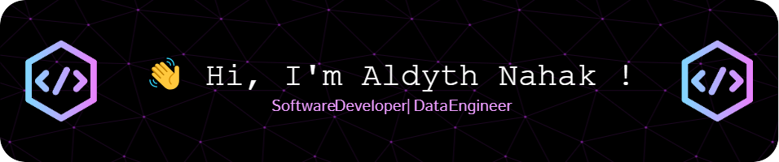

<!--
**AldythNahak/AldythNahak** is a ✨ _special_ ✨ repository because its `README.md` (this file) appears on your GitHub profile.

Here are some ideas to get you started:

- 🔭 I’m currently working on ...
- 🌱 I’m currently learning ...
- 👯 I’m looking to collaborate on ...
- 🤔 I’m looking for help with ...
- 💬 Ask me about ...
- 📫 How to reach me: ...
- 😄 Pronouns: ...
- ⚡ Fun fact: ...
-->

> Hi, I'm a Software Developer with over 4 years of experience in building and improving applications for data analytics and automation.  
> I work on both front-end and back-end, with a focus on performance, integration, and clean code.  
> I enjoy solving problems and learning new technologies to build better solutions.

### 🌐 Socials:

  

### 🐱‍🚀 I’m currently Focusing learning

### 🧰 Tools & Languages

######

    
   

#### 🐌 My Github Stats

#### 🤖 Contribution

###

<picture>
  <source media="(prefers-color-scheme: dark)" srcset="https://raw.githubusercontent.com/AldythNahak/AldythNahak/output/pacman-contribution-graph-dark.svg">
  <source media="(prefers-color-scheme: light)" srcset="https://raw.githubusercontent.com/AldythNahak/AldythNahak/output/pacman-contribution-graph.svg">
  
</picture>

#### 💰 You can help me by Donating

