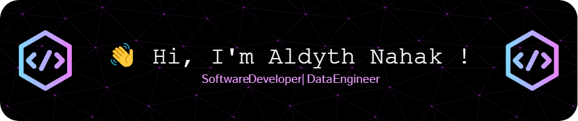

# Hi, I'm Aldyth Nahak 👋

> Software Engineer • AI Engineer • Data Engineer

I'm a Software Engineer with 5+ years of experience building scalable backend systems, data platforms, and AI-powered applications.

My experience spans enterprise banking systems, data engineering, backend development, and AI evaluation. Recently, I've been working on LLM evaluation, agentic AI benchmarks, prompt engineering, and AI-assisted software engineering while continuing to build modern web applications.

I'm passionate about solving complex problems, building reliable software, and exploring how AI can improve developer productivity and real-world products.

🌐 **Portfolio:** https://aldythn99-web.vercel.app/

---

## 🚀 What I'm Working On

- 🤖 AI & LLM Evaluation
- 🧠 Agentic AI Benchmarks
- ⚙️ Backend Engineering (Go & Python)
- 📊 Data Engineering & Analytics
- 🌍 Open Source Projects

---

## 🌐 Connect with Me

---

## 💻 Tech Stack

### Languages

### Backend

### Database

Redis • SQL Server • Oracle • Elasticsearch • Kafka

### AI & Data

- Google Gemini API
- Prompt Engineering
- LLM Evaluation
- AI Code Review
- Data Annotation
- Streamlit
- Pandas
- NumPy

### Tools

Git • GitHub • GitLab • Docker • Postman • VS Code • Linux • Swagger • Jenkins

---

## ⭐ Featured Projects

### 🎵 MoodTune AI
AI-powered music recommendation platform using Gemini API + Spotify API.

### 💳 Customer Journey Analytics
Enterprise banking platform for monitoring customer lifecycle and credit card analytics.

### 🤖 AI Benchmark Development
Designed evaluation tasks, datasets, and code review workflows for large language models.

### 📊 Marketing Analytics Platform
Centralized reporting platform for business intelligence and transaction analytics.

---

## 📈 GitHub Stats

---

## 🐍 Contributions

<picture>
  <source media="(prefers-color-scheme: dark)" srcset="https://raw.githubusercontent.com/AldythNahak/AldythNahak/output/pacman-contribution-graph-dark.svg">
  
</picture>

---

## ☕ Support

If you like my work, consider supporting me.

